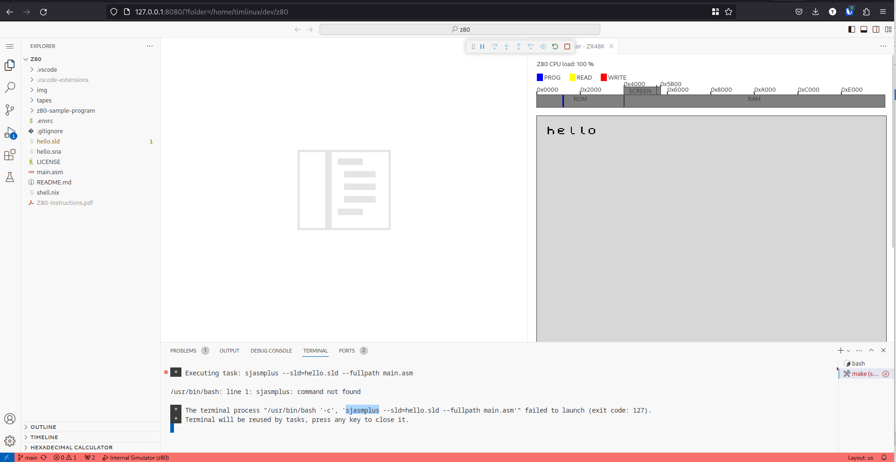
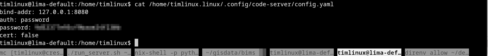
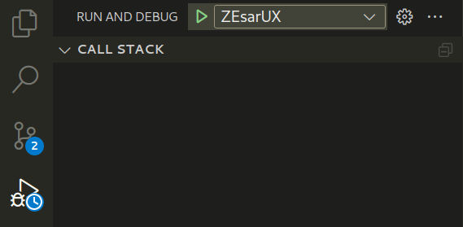

# Nix shell environment for ZX80 / ZX Spectrum


You can do lots of different things with this environment. The main activities I
am concerned with are:

1. Running tapes (ROMS) for old games etc.
2. Writing and running programs in Z80 assembler.


## Running tapes


You can also download other tapes from https://worldofspectrum.org/

To run a tape, download it from the site above, unzip it in e.g. the tapes folder and then do:

```
zesarux tapes/Con-Quest.tap/CON-QUES.TAP
```

## Z80 Assembly Language Coding 

See  https://github.com/maziac/DeZog#dezog for how to work with Z80 assembler in vscode.

The hello example here is copied from that site and adapted to work out the box
with this setup.

There are basically 3 different ZXSpectrum emulators you can use:

* internal - which is bundled with DeZog but is not a fully compliant implementation
* zesarux - which is bundled in this nix shell environment
* cspect - I've never tried to use that -  and there is no nix package for it.


## Running under lima

There is a bug that prevents DeZog running properly under Nixos which for now means 
we need to use an alternative workflow.

### 🪛Use case:

I want to use DeZog but the extension does not work on NixOS (no idea why) so I
thought I could use VSCode inside an Ubuntu container, connecting to it via my
web browser

### 🔑Key Technologies:

* [Lima](https://github.com/lima-vm/lima) : Provides a seamless WSL like experience for MacOS and Linux
* [Code Server](https://github.com/coder/code-server) : Provides a deployment of VSCode that runs as over the web
* [DeZog](https://github.com/maziac/DeZog) : A Z80 Assembler dev kit. The specific use case I was applying this to - the workflow can be used for any use case though.

### 🏆️Outcome

Here we can see VSCode running in my browser, connected to an ubuntu VM in Lima.



### 📝 Setup

#### Lima

Lima will create a VM, mount your home dir in it and forward any ports created in it out to your host.

```
nix-shell -p lima
```

Or add it to your shell.nix

The first time you use Lima you need to initialise it, set up a vm etc:

```
limactl start default
limactl bash
# You are now in ubuntu
exit
```

### Code Server

Now we can install VSCode

```
limactl bash
curl -fsSL https://code-server.dev/install.sh | sh
code-server
```

After which you should see something like this in your shell:

```
timlinux@lima-default:/home/timlinux$ code-server
[2024-02-07T20:48:10.772Z] info  Wrote default config file to /home/timlinux.linux/.config/code-server/config.yaml
[2024-02-07T20:48:11.144Z] info  code-server 4.21.0 84ca27278b68150e22d25ec9183a4835239b6e44
[2024-02-07T20:48:11.145Z] info  Using user-data-dir /home/timlinux.linux/.local/share/code-server
[2024-02-07T20:48:11.161Z] info  Using config file /home/timlinux.linux/.config/code-server/config.yaml
[2024-02-07T20:48:11.161Z] info  HTTP server listening on http://127.0.0.1:8080/
[2024-02-07T20:48:11.161Z] info    - Authentication is enabled
[2024-02-07T20:48:11.161Z] info      - Using password from /home/timlinux.linux/.config/code-server/config.yaml
[2024-02-07T20:48:11.161Z] info    - Not serving HTTPS
[2024-02-07T20:48:11.161Z] info  Session server listening on /home/timlinux.linux/.local/share/code-server/code-server-ipc.sock
[20:54:03]
```

Opening the link on port 8080 will take you to the VSCode instance

### Logging in to Code Server

You need to get the password placed in the ``/home/timlinux.linux/.config/code-server/config.yaml``. Open another terminal tab then do this:

```
lima bash
cat /home/timlinux.linux/.config/code-server/config.yaml
```



Use the password listed there to open your VSCode

### Issues with VSCode extensions

Some extensions may not work or be available in the VSCode extension manager. You can install extensions manually by downloading them e.g. from the DeZog site and then using the manual install option.

### Sjasmplus

This is specific to dezog: I had to get sjasmplus installed like this:

```
 git clone https://github.com/z00m128/sjasmplus.git
 cd sjasmplus/
 sudo apt install cmake build-essential
 git submodule init
 git submodule update
 mkdir build
 cd build
 cmake ..
 make
 sudo make install
 which sjasmplus
```

After doing that the sjasmplus task in vscode will work if it can write to the folder.


## Running natively under Nixos

📒 THESE INSTRUCTIONS WON'T WORK - DEZOG DOES NOT WORK ON VSCODE IN NIXOS
See : https://github.com/maziac/DeZog/issues/123


To run the hello example here do the following:

```
code .
```

This will open VSCode using the version installed in this nix shell, with 
this folder opened and ready to use.

In VSCode you need to install the extensions listed in the DeZog home page. These are the ones I finally ended up with:

* [ASM Code Lens](https://marketplace.visualstudio.com/items?itemName=maziac.asm-code-lens)
* [DeZog](https://marketplace.visualstudio.com/items?itemName=maziac.dezog)
* [Hex Hover Converter](https://marketplace.visualstudio.com/items?itemName=maziac.hex-hover-converter)
* [SNA File Viewer](https://marketplace.visualstudio.com/items?itemName=maziac.sna-fileviewer)
* [Z80 Assembly](https://marketplace.visualstudio.com/items?itemName=Imanolea.z80-asm)
* [Z80 Instruction Set](https://marketplace.visualstudio.com/items?itemName=maziac.z80-instruction-set)
* [Z80 Assembler Tutorials and resources](https://www.chibiakumas.com/z80/ZXSpectrum.php) - fantastic resources for the hardware layout etc.
* [Z80 Assembler Instructions Cheat Sheet](https://www.chibiakumas.com/book/CheatSheetCollection.pdf)
📒 These are listed in .vscode/extensions.json so you should be prompted to install them when you open this project in VSCode.


Then do:

Terminal ➡️ Run Build Task (Crtl+Shift+B)

The program will be compiled and ``hello.sna`` will be generated.

Next do

Terminal ➡️ Run Task...

And choose the ``zesarux --noconfigfile ...`` task


That will open the emulator in debug mode:


You can verify it is running like this:

```
sudo lsof -i -P -n | grep LISTEN | grep zesarux
zesarux   190028 timlinux    8u  IPv4 1826951      0t0  TCP *:10000 (LISTEN)
```


Next you can set a break point in your code and then run it in the debugger by clicking the green triangle:




## Resources

* [Z80 Mnemonics](http://www.z80.info/z80syntx.htm) : A list of all instructions / mnemonics, with descriptions.
* [ZX Spectrum Character Set](https://worldofspectrum.net/ZXBasicManual/zxmanappa.html)
* [ZX Spectrum Manual](http://www.retro8bitcomputers.co.uk/Content/downloads/manuals/ZX-Spectrum-48K-Manual.pdf)
* [ZX Spectrum ROM Subroutines](https://skoolkid.github.io/rom/maps/routines.html)
* [ZX Spectrum Assembler Programming Tutorial Series](https://www.youtube.com/playlist?list=PLO_DS4Ra9jOooo0tFaLq-BXa24iPWkJJ7) : A really nice, slow paced and clear  step by step walk through of proamming the Spectrum Z80 in Assembly Language.
* [DeZog Detailed Reference](https://github.com/maziac/DeZog/blob/main/documentation/Usage.md) - really read this in detail!

## Credits

Example code copied from DeZog then modified by Tim.

This README and shell.nix by Tim.

Tim Sutton
Jan 2024
