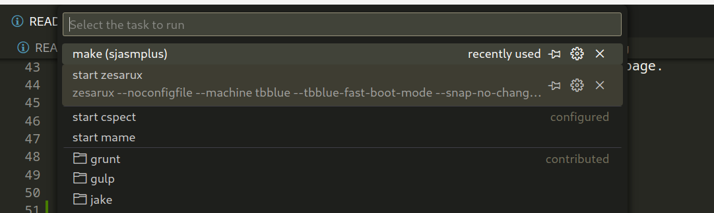
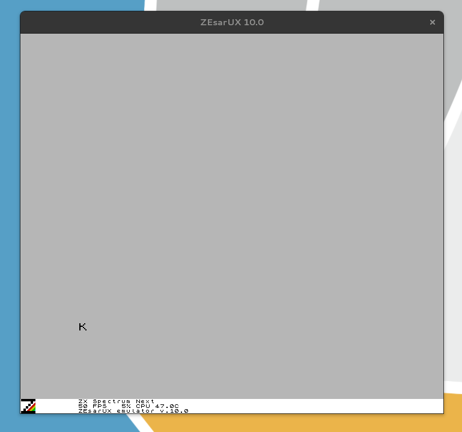

# Nix shell environment for ZX80 / ZX Spectrum

You can do lots of different things with this environment. The main activities I
am concerned with are:

1. Running tapes (ROMS) for old games etc.
2. Writing and running programs in Z80 assembler.


## Running tapes


You can also download other tapes from https://worldofspectrum.org/

To run a tape, download it from the site above, unzip it in e.g. the tapes folder and then do:

```
zesarux tapes/Con-Quest.tap/CON-QUES.TAP
```

## Z80 Assembly Language Coding 

See  https://github.com/maziac/DeZog#dezog for how to work with Z80 assembler in vscode.

The hello example here is copied from that site and adapted to work out the box
with this setup.

There are basically 3 different ZXSpectrum emulators you can use:

* internal - which is bundled with DeZog but is not a fully compliant implementation
* zesarux - which is bundled in this nix shell environment
* cspect - I've never tried to use that.

To run the hello example here do the following:

```
code .
```

This will open VSCode using the version installed in this nix shell, with 
this folder opened and ready to use.

In VSCode you need to install the extensions listed in the DeZog home page.

Then do:

Terminal ➡️ Run Build Task (Crtl+Shift+B)

The program will be compiled and ``hello.sna`` will be generated.

Next do

Terminal ➡️ Run Task...

And choose the ``zesarux --noconfigfile ...`` task




That will open the emulator in debug mode:




Then select 

## Credits

Example code copied from DeZog then modified by Tim.

This README and shell.nix by Tim.

Tim Sutton
Jan 2024
