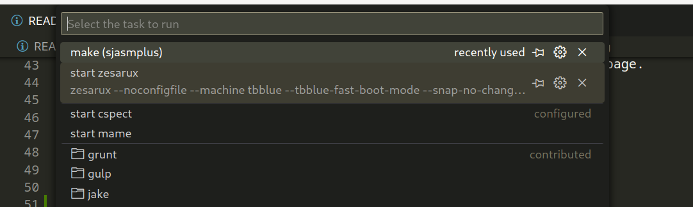
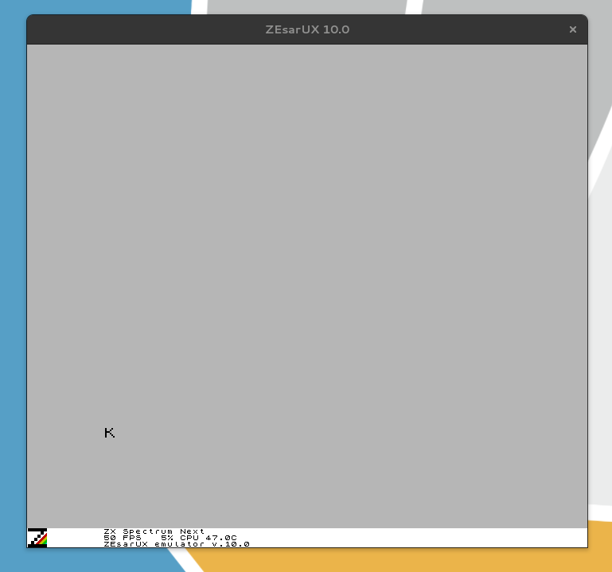
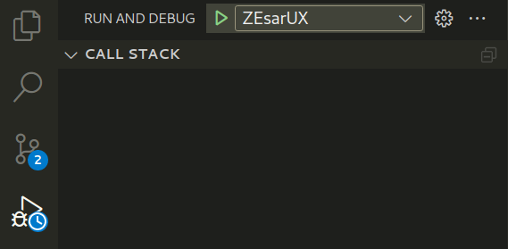
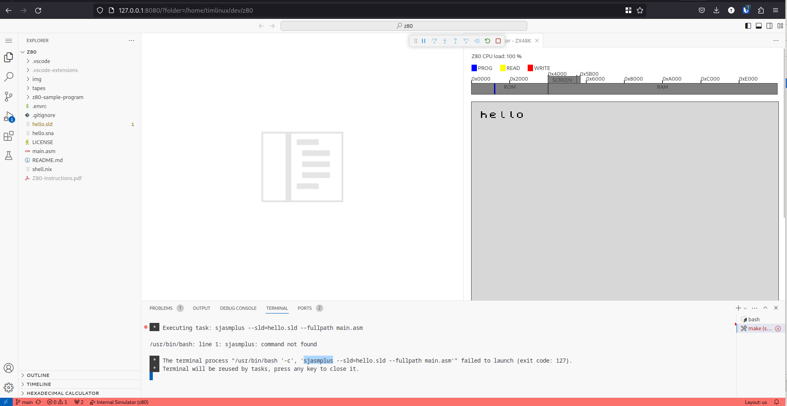
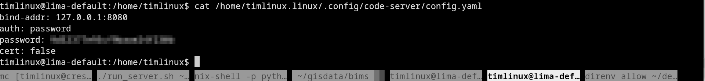

# Nix shell environment for ZX80 / ZX Spectrum

A reproducible dev environment for writing Z80 assembly that targets the
ZX Spectrum 48K, plus a tape archive for running vintage software.

Two activities are supported:

1. **Writing and running your own programs in Z80 assembler** (the main use case).
2. **Running existing tapes** (games, demos, etc.) from `tapes/`.

The flake provides `sjasmplus` (assembler), `fuse` and `zesarux` (emulators), a
suite of `nix run` helper apps, a Neovim `which-key` menu under `<leader>p`,
and a `scripts/z80-new-program` scaffolder that drops a heavily-commented
template into a new folder.

> 📚 Everything in this repo is written for **relearning** Z80. Templates,
> Makefiles, and inline comments lean towards "explain it like 1982" rather
> than "fit on one line." If you spot something underexplained, raise an issue.

---

## Quick start — building and running your own program

### From the shell (via the flake)

Drop into the dev shell once per terminal:

```bash
direnv allow            # auto-enters the flake on cd
# …or:
nix develop
```

Then:

```bash
# Scaffold a new program with the heavily-commented template:
nix run .#new -- pong

# Edit it:
nvim pong/main.asm

# Assemble + run instantly (SNA snapshot, sub-second boot):
nix run .#run -- pong/main.asm

# Or the authentic LOAD "" tape experience:
nix run .#run -- pong/pong.tap

# Or simply, from inside the program's dir:
cd pong && make            # assemble + run via SNA
cd pong && make run-tap    # run via tape autoload
cd pong && make debug      # ZEsarUX with ZRCP on port 10000 (for DeZog)
```

### From Neovim (which-key menu under `<leader>p`)

| Key | Action |
| --- | --- |
| `<leader>pc` | Compile the current `.asm` file |
| `<leader>pr` | Build & run (smart: prefers `.sna`) |
| `<leader>pf` | Force run in FUSE |
| `<leader>pz` | Force run in ZEsarUX |
| `<leader>pd` | Debug — ZEsarUX with ZRCP on port 10000 |
| `<leader>pn` | Scaffold a new program |
| `<leader>pp` | Pick & open an existing program |
| `<leader>pt` | Browse `tapes/` and load one |
| `<leader>ph` | Help for the instruction under the cursor |
| `<leader>po` | Open reference documentation |

These are wired in `.nvim.lua` / `.exrc` and use `which-key.nvim` when present.
The Lua module hangs off `_G.Z80Dev`, so you can also call e.g.
`:lua Z80Dev.build_and_run()` from anywhere.

### SNA vs TAP — why two outputs from a single source

The template's `main.asm` ends with:

```asm
EMPTYTAP "name.tap"
SAVETAP  "name.tap", BASIC, "name", basic_loader, BASIC_LEN, 10
SAVETAP  "name.tap", CODE,  "name", start, PROG_LEN, start
SAVESNA  "name.sna", start
```

so one `sjasmplus` pass emits both files. They serve different jobs:

* **`name.sna` — full 48K snapshot.** The emulator restores memory, registers,
  and the program counter, then literally resumes execution at `start`. Comes
  up in well under a second — the right choice while you're iterating.
* **`name.tap` — a self-running tape.** Two blocks: a tiny BASIC loader (line
  10, autostart line set in the header) and the code block. The BASIC line
  is the historical Spectrum trick:

  ```basic
  10 CLEAR 32767 : LOAD "" CODE : RANDOMIZE USR 32768
  ```

  `CLEAR 32767` reserves the memory above which our code sits; `LOAD "" CODE`
  pulls in the next tape block (the binary); `RANDOMIZE USR 32768` jumps into
  it. This is what every commercial cassette in 1982 was doing.

The run scripts default to the `.sna` path — that's the development fast
lane. Reach for the `.tap` path (`make run-tap`) when you want the authentic
loading screen, or when you're debugging the BASIC loader itself.

### Gotchas this project already works around

* **`fuse` + host `LD_LIBRARY_PATH`** — if your shell exports paths to
  `alsa` / `pipewire` libs built against a newer glibc than the nix-store
  fuse expects, fuse aborts at startup with
  `fuse: ... version 'GLIBC_ABI_DT_X86_64_PLT' not found ...`. Every
  emulator-launching helper in this repo runs `env -u LD_LIBRARY_PATH fuse`
  to dodge it.
* **`fuse` + missing audio** — the dev shell typically has no working
  ALSA backend. Every launcher passes `--no-sound` so you don't get a wall
  of ALSA warnings on each run.
* **`fuse --auto-load` + a `CODE`-only tape** — fuse types `LOAD ""` for you
  but the Spectrum ROM stops at the `K` cursor because there's no BASIC
  block to autostart. The template's BASIC autostart loader is what makes
  `make run-tap` actually run your code.

## Running existing tapes

Drop a tape file into `tapes/` (download from
[World of Spectrum](https://worldofspectrum.org/) or similar):

```bash
nix run .#tapes                              # list everything in tapes/
nix run .#tapes -- tapes/MyGame/MYGAME.TAP   # run a specific one
```

Or from Neovim: `<leader>pt` opens a picker.

## Legacy: VS Code + DeZog workflow

The repo originally targeted [DeZog](https://github.com/maziac/DeZog) in
VS Code. That workflow still works — `make debug` (or `<leader>pd`) launches
ZEsarUX with the ZRCP debug protocol on port 10000, which DeZog connects to.

There are basically 3 different ZXSpectrum emulators you can use:

* internal - which is bundled with DeZog but is not a fully compliant implementation
* zesarux - which is bundled in this nix shell environment
* cspect - I've never tried to use that -  and there is no nix package for it.

## Running natively under Nixos

📒 Note:

> In older versions I had issues running Dezog under nixos - 
> see the last section of this document if that is the case for 
> you for an alternative approach to setting up your environment
> using Lima.
>
> See : https://github.com/maziac/DeZog/issues/123


To run the hello example here do the following:

```
code .
```

This will open VSCode using the version installed in this nix shell, with 
this folder opened and ready to use.

In VSCode you need to install the extensions listed in the DeZog home page. These are the ones I finally ended up with:

* [ASM Code Lens](https://marketplace.visualstudio.com/items?itemName=maziac.asm-code-lens)
* [DeZog](https://marketplace.visualstudio.com/items?itemName=maziac.dezog)
* [Hex Hover Converter](https://marketplace.visualstudio.com/items?itemName=maziac.hex-hover-converter)
* [SNA File Viewer](https://marketplace.visualstudio.com/items?itemName=maziac.sna-fileviewer)
* [Z80 Assembly](https://marketplace.visualstudio.com/items?itemName=Imanolea.z80-asm)
* [Z80 Instruction Set](https://marketplace.visualstudio.com/items?itemName=maziac.z80-instruction-set)
* [Z80 Assembler Tutorials and resources](https://www.chibiakumas.com/z80/ZXSpectrum.php) - fantastic resources for the hardware layout etc.
* [Z80 Assembler Instructions Cheat Sheet](https://www.chibiakumas.com/book/CheatSheetCollection.pdf)
📒 These are listed in .vscode/extensions.json so you should be prompted to install them when you open this project in VSCode.


Then do:

Terminal ➡️ Run Build Task (Crtl+Shift+B)

The program will be compiled and ``hello.sna`` will be generated.

Next do

Terminal ➡️ Run Task...

And choose the ``zesarux --noconfigfile ...`` task




That will open the emulator in debug mode:




You can verify it is running like this:

```
sudo lsof -i -P -n | grep LISTEN | grep zesarux
zesarux   190028 timlinux    8u  IPv4 1826951      0t0  TCP *:10000 (LISTEN)
```


Next you can set a break point in your code and then run it in the debugger by clicking the green triangle:




## Resources

* [Z80 Mnemonics](http://www.z80.info/z80syntx.htm) : A list of all instructions / mnemonics, with descriptions.
* [ZX Spectrum Character Set](https://worldofspectrum.net/ZXBasicManual/zxmanappa.html)
* [ZX Spectrum Manual](http://www.retro8bitcomputers.co.uk/Content/downloads/manuals/ZX-Spectrum-48K-Manual.pdf)
* [ZX Spectrum ROM Subroutines](https://skoolkid.github.io/rom/maps/routines.html)
* [ZX Spectrum Assembler Programming Tutorial Series](https://www.youtube.com/playlist?list=PLO_DS4Ra9jOooo0tFaLq-BXa24iPWkJJ7) : A really nice, slow paced and clear  step by step walk through of proamming the Spectrum Z80 in Assembly Language.
* [DeZog Detailed Reference](https://github.com/maziac/DeZog/blob/main/documentation/Usage.md) - really read this in detail!
* [ZXLoad](https://loadzx.com) - online museum dedicated to the ZX Spectrum

## Credits

Example code copied from DeZog then modified by Tim.

This README and shell.nix by Tim.

Tim Sutton
Jan 2024


Deprecated notes in case you cannot run it under NixOS (Works for me as of Nix 24.11)


## Running under lima

There was a bug that prevents DeZog running properly under Nixos which means 
we need to also be able to use an alternative workflow.

### 🪛Use case:

I want to use DeZog but the extension does not work on NixOS (no idea why) so I
thought I could use VSCode inside an Ubuntu container, connecting to it via my
web browser

### 🔑Key Technologies:

* [Lima](https://github.com/lima-vm/lima) : Provides a seamless WSL like experience for MacOS and Linux
* [Code Server](https://github.com/coder/code-server) : Provides a deployment of VSCode that runs as over the web
* [DeZog](https://github.com/maziac/DeZog) : A Z80 Assembler dev kit. The specific use case I was applying this to - the workflow can be used for any use case though.

### 🏆️Outcome

Here we can see VSCode running in my browser, connected to an ubuntu VM in Lima.



### 📝 Setup

#### Lima

Lima will create a VM, mount your home dir in it and forward any ports created in it out to your host.

```
nix-shell -p lima
```

Or add it to your shell.nix

The first time you use Lima you need to initialise it, set up a vm etc:

```
limactl start default
limactl bash
# You are now in ubuntu
exit
```

## Mounting the z80 folder in Lima

The home dir from your user will be read only. That will mean we cannot commit changes etc.

So edit ~/.lima/default/lima.yaml and add an entry like this:

```
  - location: "/home/timlinux/dev/z80"
  # 🟢 Builtin default: false
  # 🔵 This file: true (only for "/tmp/lima")
  writable: true
```
Now stop and start lima:


```
limactl stop default
limactl start default
```


### Code Server

Now we can install VSCode

```
limactl bash
curl -fsSL https://code-server.dev/install.sh | sh
code-server
```

After which you should see something like this in your shell:

```
timlinux@lima-default:/home/timlinux$ code-server
[2024-02-07T20:48:10.772Z] info  Wrote default config file to /home/timlinux.linux/.config/code-server/config.yaml
[2024-02-07T20:48:11.144Z] info  code-server 4.21.0 84ca27278b68150e22d25ec9183a4835239b6e44
[2024-02-07T20:48:11.145Z] info  Using user-data-dir /home/timlinux.linux/.local/share/code-server
[2024-02-07T20:48:11.161Z] info  Using config file /home/timlinux.linux/.config/code-server/config.yaml
[2024-02-07T20:48:11.161Z] info  HTTP server listening on http://127.0.0.1:8080/
[2024-02-07T20:48:11.161Z] info    - Authentication is enabled
[2024-02-07T20:48:11.161Z] info      - Using password from /home/timlinux.linux/.config/code-server/config.yaml
[2024-02-07T20:48:11.161Z] info    - Not serving HTTPS
[2024-02-07T20:48:11.161Z] info  Session server listening on /home/timlinux.linux/.local/share/code-server/code-server-ipc.sock
[20:54:03]
```

Opening the link on port 8080 will take you to the VSCode instance

### Logging in to Code Server

You need to get the password placed in the ``/home/timlinux.linux/.config/code-server/config.yaml``. Open another terminal tab then do this:

```
lima bash
cat /home/timlinux.linux/.config/code-server/config.yaml
```



Use the password listed there to open your VSCode

### Issues with VSCode extensions

Some extensions may not work or be available in the VSCode extension manager. You can install extensions manually by downloading them e.g. from the DeZog site and then using the manual install option.

### Sjasmplus

This is specific to dezog: I had to get sjasmplus installed like this:

```
 git clone https://github.com/z00m128/sjasmplus.git
 cd sjasmplus/
 sudo apt install cmake build-essential
 git submodule init
 git submodule update
 mkdir build
 cd build
 cmake ..
 make
 sudo make install
 which sjasmplus
```

After doing that the sjasmplus task in vscode will work if it can write to the folder.


